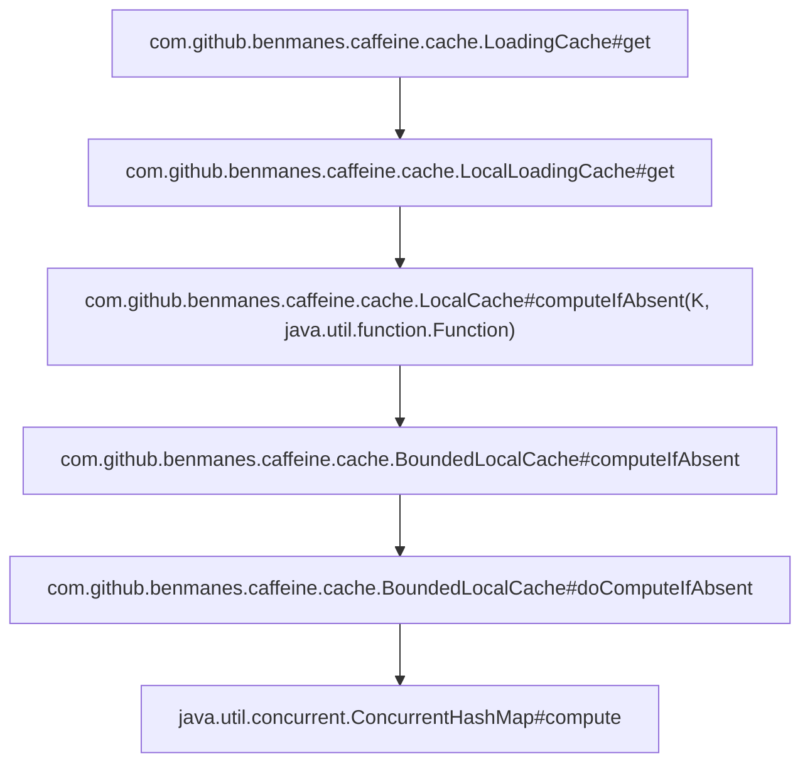
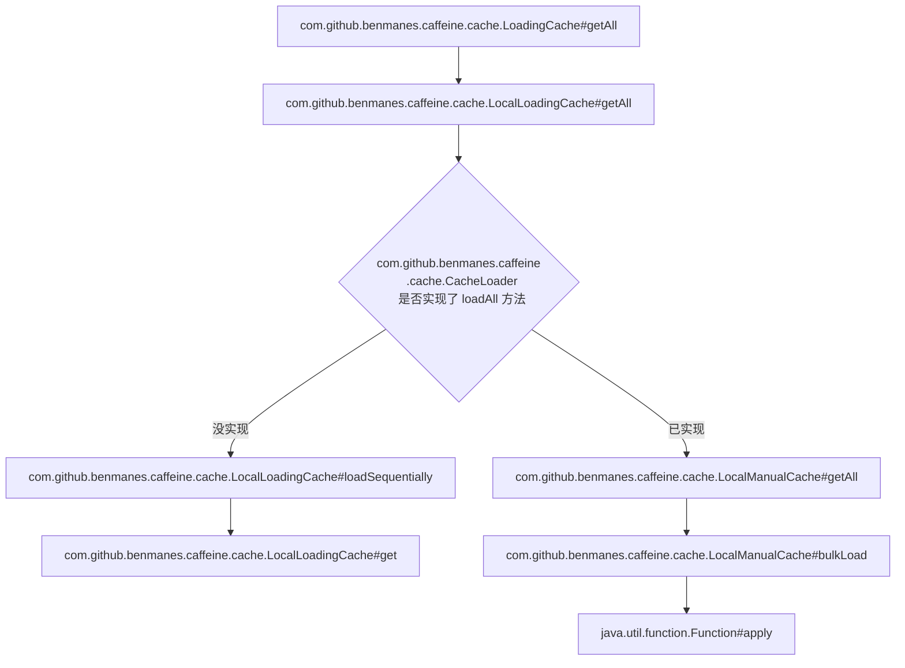
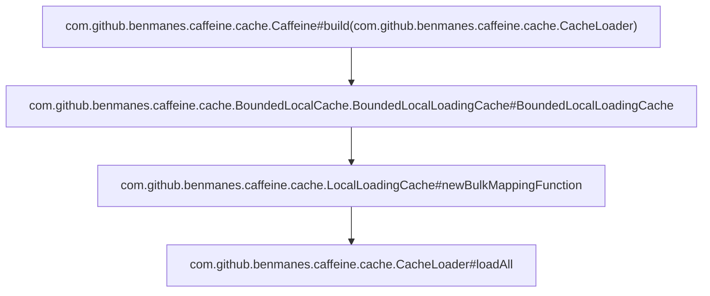

## 先说结论
调用 com.github.benmanes.caffeine.cache.LoadingCache#getAll 批量读取缓存，当缓存里key不存在时，假设有3个key不存在。
1. 如果实现了 com.github.benmanes.caffeine.cache.CacheLoader#loadAll 方法，就会调用 loadAll 方法批量加载缓存，有10个客户端请求并发访问，10个客户端请求会分别调用 loadAll 查询3个key，也就是回源30次
2. 如果没实现 loadAll 方法，会顺序调用 com.github.benmanes.caffeine.cache.LocalLoadingCache#get 方法读取缓存，当10个客户端请求并发请求某一个key时，多个线程会进行竞争，没竞争过的线程会被阻塞，直到前面的线程更新缓存完成，也就是回源3次

## 做实验
caffeine 版本 2.9.3

下面的代码是单元测试，可以直接跑


```java
package com.jk2k.test;

import cn.hutool.json.JSONUtil;
import com.github.benmanes.caffeine.cache.CacheLoader;
import com.github.benmanes.caffeine.cache.Caffeine;
import com.github.benmanes.caffeine.cache.LoadingCache;
import lombok.extern.slf4j.Slf4j;
import org.checkerframework.checker.nullness.qual.NonNull;
import org.checkerframework.checker.nullness.qual.Nullable;
import org.junit.jupiter.api.Test;
import org.junit.jupiter.api.extension.ExtendWith;
import org.springframework.test.context.junit.jupiter.SpringExtension;

import java.time.Duration;
import java.util.*;
import java.util.concurrent.ExecutionException;
import java.util.concurrent.ExecutorService;
import java.util.concurrent.Executors;
import java.util.concurrent.Future;
import java.util.concurrent.atomic.AtomicInteger;

/**
 * 测试case
 * <p>
 * Q1. 批量 load keys
 * 回答：没问题
 *
 * Q2. key 不存在，并发访问，回源情况
 * 回答：使用 getAll，每次缓存失效，都是调用 loadAll, 有10个客户端请求，10个客户端请求都会回源
 * 使用 get，每次缓存失效，10个客户端请求，只会有1个客户端请求回源，其他请求等待该线程拿到数据后再返回给客户端
 *
 * Q3. 什么情况调用 loadAll，什么情况调用 loadOne?
 * 回答：
 * 1. 只使用 expireAfterWrite，每次都是调用 loadAll，缓存里有key，该key就用缓存里的，没有的就调用 loadAll 批量加载
 * 2. 同时使用 expireAfterWrite 和 refreshAfterWrite，缓存里有key标记为可刷新时，先返回旧的数据，然后异步调用 loadOne 刷新数据，如果缓存里没有key，就调用 loadAll 批量加载
 *
 * Q4. expireAfterWrite 和 refreshAfterWrite 区别?
 * 回答：expireAfterWrite 代表缓存key啥时候失效, refreshAfterWrite 代表缓存key啥时候标记为可刷新，常用做法是，expireAfterWrite 设为 60秒
 * refreshAfterWrite 设为 5 秒，代表缓存写入60秒后失效（失效的意思是缓存里就没有这个key了），缓存写入5秒后可调用 loadOne 刷新缓存
 */
@ExtendWith(SpringExtension.class)
@Slf4j
public class LocalCacheConcurrentTest {
    /**
     * 如果key不存在，会出现10个客户端请求，10个客户端请求都会去回源
     */
    @Test
    public void testConcurrentVisitCase1() {
        AtomicInteger returnToSourceNum = new AtomicInteger(0);

        LoadingCache<String, List<String>> loadingCache = Caffeine.newBuilder()
                .maximumSize(1000)
                .expireAfterWrite(Duration.ofMinutes(120))
//                .refreshAfterWrite(Duration.ofMinutes(60))
                .recordStats().build(new CacheLoader<String, List<String>>() {
                    @Override
                    public @NonNull Map<@NonNull String, @NonNull List<String>> loadAll(@NonNull Iterable<? extends @NonNull String> keys) throws Exception {
                        log.info("call loadAll: {}", JSONUtil.toJsonStr(keys));
                        return new HashMap<String, List<String>>() {{
                            returnToSourceNum.incrementAndGet();
                            put("aaaa1", Arrays.asList("111", "111", "111"));
                            put("aaaa2", Arrays.asList("111", "111", "111"));
                        }};
                    }

                    @Override
                    public @Nullable List<String> load(@NonNull String key) throws Exception {
                        returnToSourceNum.incrementAndGet();
                        log.info("call loadOne: {}", key);
                        return Arrays.asList("111", "111", "111");
                    }
                });

        List<String> keys = generateKeys();
        initiateRequest(loadingCache, keys);
        initiateRequest(loadingCache, keys);

        log.info("回源次数: {}", returnToSourceNum);
        log.info("done");
    }

    /**
     * 如果key在缓存里，后续请求不会再回源
     */
    @Test
    public void testConcurrentVisitCase2() {
        AtomicInteger returnToSourceNum = new AtomicInteger(0);

        LoadingCache<String, List<String>> loadingCache = Caffeine.newBuilder()
                .maximumSize(1000)
                .expireAfterWrite(Duration.ofMinutes(120))
//                .refreshAfterWrite(Duration.ofMinutes(60))
                .recordStats().build(new CacheLoader<String, List<String>>() {
                    @Override
                    public @NonNull Map<@NonNull String, @NonNull List<String>> loadAll(@NonNull Iterable<? extends @NonNull String> keys) throws Exception {
                        log.info("call loadAll");
                        log.info("keys: {}", JSONUtil.toJsonStr(keys));
                        return new HashMap<String, List<String>>() {{
                            returnToSourceNum.incrementAndGet();
                            for (int i = 0; i < 10; i++) {
                                put("aaaa" + i, Arrays.asList("111", "111", "111"));
                            }
                        }};
                    }

                    @Override
                    public @Nullable List<String> load(@NonNull String key) throws Exception {
                        returnToSourceNum.incrementAndGet();
                        log.info("call loadOne");
                        return Arrays.asList("111", "111", "111");
                    }
                });

        List<String> keys = generateKeys();
        initiateRequest(loadingCache, keys);
        initiateRequest(loadingCache, keys);

        log.info("回源次数: {}", returnToSourceNum);
        log.info("done");
    }

    /**
     * 缓存失效后，异步刷新，会调用 loadOne
     * 会把之前的结果返回
     */
    @Test
    public void testConcurrentVisitCase3() {
        AtomicInteger returnToSourceNum = new AtomicInteger(0);
        AtomicInteger waveNum = new AtomicInteger(0);

        LoadingCache<String, List<String>> loadingCache = Caffeine.newBuilder()
                .maximumSize(1000)
                .expireAfterWrite(Duration.ofSeconds(5))
                .refreshAfterWrite(Duration.ofSeconds(2))
                .recordStats().build(new CacheLoader<String, List<String>>() {
                    @Override
                    public @NonNull Map<@NonNull String, @NonNull List<String>> loadAll(@NonNull Iterable<? extends @NonNull String> keys) throws Exception {
                        log.info("call loadAll: {}", JSONUtil.toJsonStr(keys));
                        return new HashMap<String, List<String>>() {{
                            returnToSourceNum.incrementAndGet();
                            Iterator<String> iterator = (Iterator<String>) keys.iterator();
                            while (iterator.hasNext()) {
                                String key = iterator.next();
                                if (waveNum.get() == 1) {
                                    put(key, Arrays.asList("111", "111", "111"));
                                } else {
                                    put(key, Arrays.asList("333", "333", "333"));
                                }
                            }
                        }};
                    }

                    @Override
                    public @Nullable List<String> load(@NonNull String key) throws Exception {
                        returnToSourceNum.incrementAndGet();
                        log.info("call loadOne: {}", key);
                        return Arrays.asList("222", "222", "222");
                    }
                });

        log.info("第一波");
        List<String> keys = generateKeys();
        waveNum.incrementAndGet();
        initiateRequest(loadingCache, keys);
        log.info("回源次数: {}", returnToSourceNum);
        try {
            Thread.sleep(Duration.ofSeconds(3).toMillis());
        } catch (InterruptedException e) {
            throw new RuntimeException(e);
        }
        log.info("第二波");
        initiateRequest(loadingCache, keys);
        log.info("回源次数: {}", returnToSourceNum);
        try {
            Thread.sleep(Duration.ofSeconds(5).toMillis());
        } catch (InterruptedException e) {
            throw new RuntimeException(e);
        }
        log.info("第三波");
        waveNum.incrementAndGet();
        initiateRequest(loadingCache, keys);
        log.info("回源次数: {}", returnToSourceNum);

        log.info("done");
    }

    /**
     * 缓存失效后，同步刷新，
     * 会把最新的结果返回
     */
    @Test
    public void testConcurrentVisitCase4() {
        AtomicInteger returnToSourceNum = new AtomicInteger(0);
        AtomicInteger waveNum = new AtomicInteger(0);

        LoadingCache<String, List<String>> loadingCache = Caffeine.newBuilder()
                .maximumSize(1000)
                .expireAfterWrite(Duration.ofSeconds(2))
//                .refreshAfterWrite(Duration.ofSeconds(2))
                .recordStats().build(new CacheLoader<String, List<String>>() {
                    @Override
                    public @NonNull Map<@NonNull String, @NonNull List<String>> loadAll(@NonNull Iterable<? extends @NonNull String> keys) throws Exception {
                        log.info("call loadAll");
                        log.info("keys: {}", JSONUtil.toJsonStr(keys));
                        return new HashMap<String, List<String>>() {{
                            returnToSourceNum.incrementAndGet();
                            Iterator<String> iterator = (Iterator<String>) keys.iterator();
                            while (iterator.hasNext()) {
                                String key = iterator.next();
                                if (waveNum.get() == 1) {
                                    put(key, Arrays.asList("111", "111", "111"));
                                } else {

                                    put(key, Arrays.asList("222", "222", "222"));
                                }
                            }
                        }};
                    }

                    @Override
                    public @Nullable List<String> load(@NonNull String key) throws Exception {
                        returnToSourceNum.incrementAndGet();
                        log.info("call loadOne: {}", key);
                        return Arrays.asList("222", "222", "222");
                    }
                });

        List<String> keys = generateKeys();
        waveNum.incrementAndGet();
        log.info("第一波。。");
        initiateRequest(loadingCache, keys);
        log.info("第二波。。");
        initiateRequest(loadingCache, keys);
        try {
            Thread.sleep(Duration.ofSeconds(3).toMillis());
        } catch (InterruptedException e) {
            throw new RuntimeException(e);
        }
        waveNum.incrementAndGet();
        log.info("第三波。。");
        initiateRequest(loadingCache, keys);

        log.info("回源次数: {}", returnToSourceNum);
        log.info("done");
    }

    /**
     * 缓存失效后，同步刷新，key 写入时机不一样
     * 会把最新的结果返回
     */
    @Test
    public void testConcurrentVisitCase5() {
        AtomicInteger returnToSourceNum = new AtomicInteger(0);
        AtomicInteger waveNum = new AtomicInteger(0);

        LoadingCache<String, List<String>> loadingCache = Caffeine.newBuilder()
                .maximumSize(1000)
                .expireAfterWrite(Duration.ofSeconds(3))
//                .refreshAfterWrite(Duration.ofSeconds(2))
                .recordStats().build(new CacheLoader<String, List<String>>() {
                    @Override
                    public @NonNull Map<@NonNull String, @NonNull List<String>> loadAll(@NonNull Iterable<? extends @NonNull String> keys) throws Exception {
                        log.info("call loadAll: {}", JSONUtil.toJsonStr(keys));
                        return new HashMap<String, List<String>>() {{
                            returnToSourceNum.incrementAndGet();
                            Iterator<String> iterator = (Iterator<String>) keys.iterator();
                            while (iterator.hasNext()) {
                                String key = iterator.next();
                                if (waveNum.get() == 1) {
                                    put(key, Arrays.asList("111", "111", "111"));
                                } else {

                                    put(key, Arrays.asList("222", "222", "222"));
                                }
                            }
                        }};
                    }

                    @Override
                    public @Nullable List<String> load(@NonNull String key) throws Exception {
                        returnToSourceNum.incrementAndGet();
                        log.info("call loadOne: {}", key);
                        return Arrays.asList("222", "222", "222");
                    }
                });

        List<String> keys = generateKeys();
        waveNum.incrementAndGet();
        log.info("第一波。。");
        initiateRequest(loadingCache, keys.subList(0, 5));
        log.info("回源次数: {}", returnToSourceNum);
        try {
            Thread.sleep(Duration.ofSeconds(2).toMillis());
        } catch (InterruptedException e) {
            throw new RuntimeException(e);
        }
        log.info("第二波。。");
        initiateRequest(loadingCache, keys);
        log.info("回源次数: {}", returnToSourceNum);
        try {
            Thread.sleep(Duration.ofSeconds(1).toMillis());
        } catch (InterruptedException e) {
            throw new RuntimeException(e);
        }
        waveNum.incrementAndGet();
        log.info("第三波。。");
        initiateRequest(loadingCache, keys);

        log.info("回源次数: {}", returnToSourceNum);
        log.info("done");
    }

    /**
     * 如果key不存在，会出现10个客户端请求，只有1个客户端请求会去回源，其他的等待这个线程
     */
    @Test
    public void testConcurrentVisitCase6() {
        AtomicInteger returnToSourceNum = new AtomicInteger(0);

        LoadingCache<String, List<String>> loadingCache = Caffeine.newBuilder()
                .maximumSize(1000)
                .expireAfterWrite(Duration.ofMinutes(120))
//                .refreshAfterWrite(Duration.ofMinutes(60))
                .recordStats().build(new CacheLoader<String, List<String>>() {
                    @Override
                    public @NonNull Map<@NonNull String, @NonNull List<String>> loadAll(@NonNull Iterable<? extends @NonNull String> keys) throws Exception {
                        log.info("call loadAll: {}", JSONUtil.toJsonStr(keys));
                        return new HashMap<String, List<String>>() {{
                            returnToSourceNum.incrementAndGet();
                            put("aaaa1", Arrays.asList("111", "111", "111"));
                            put("aaaa2", Arrays.asList("111", "111", "111"));
                        }};
                    }

                    @Override
                    public @Nullable List<String> load(@NonNull String key) throws Exception {
                        returnToSourceNum.incrementAndGet();
                        log.info("call loadOne: {}", key);
                        return Arrays.asList("111", "111", "111");
                    }
                });

        initiateRequestAndGetOne(loadingCache, "aaaa1");
        initiateRequestAndGetOne(loadingCache, "aaaa1");

        log.info("回源次数: {}", returnToSourceNum);
        log.info("done");
    }

    private void initiateRequest(LoadingCache<String, List<String>> loadingCache, List<String> keys) {
        // 创建一个固定大小为20的线程池
        ExecutorService executorService = Executors.newFixedThreadPool(20);

        // 创建一个列表来存储Future对象，表示任务的结果
        List<Future<String>> futures = new ArrayList<>();

        // 提交20个任务到线程池
        for (int i = 0; i < 20; i++) {
            int taskNumber = i; // 为了避免lambda表达式中的变量作用域问题
            Future<String> future = executorService.submit(() -> {
                // 这里是要执行的任务代码
                String result = "Task " + taskNumber + " executed by " + Thread.currentThread().getName();
                Map<String, List<String>> cachedData = loadingCache.getAll(keys);
                log.info("cachedData, {}", JSONUtil.toJsonStr(cachedData));
                return result;
            });
            futures.add(future);
        }

        // 等待所有任务完成并获取结果
        for (Future<String> future : futures) {
            try {
                String result = future.get(); // 获取任务的执行结果
                log.info("Result: {}", result);
            } catch (InterruptedException | ExecutionException e) {
                e.printStackTrace();
            }
        }

        // 关闭线程池
        executorService.shutdown();
    }

    private void initiateRequestAndGetOne(LoadingCache<String, List<String>> loadingCache, String key) {
        // 创建一个固定大小为20的线程池
        ExecutorService executorService = Executors.newFixedThreadPool(20);

        // 创建一个列表来存储Future对象，表示任务的结果
        List<Future<String>> futures = new ArrayList<>();

        // 提交20个任务到线程池
        for (int i = 0; i < 20; i++) {
            int taskNumber = i; // 为了避免lambda表达式中的变量作用域问题
            Future<String> future = executorService.submit(() -> {
                // 这里是要执行的任务代码
                String result = "Task " + taskNumber + " executed by " + Thread.currentThread().getName();
                List<String> cachedData = loadingCache.get(key);
                log.info("cachedData, {}", JSONUtil.toJsonStr(cachedData));
                return result;
            });
            futures.add(future);
        }

        // 等待所有任务完成并获取结果
        for (Future<String> future : futures) {
            try {
                String result = future.get(); // 获取任务的执行结果
                log.info("Result: {}", result);
            } catch (InterruptedException | ExecutionException e) {
                e.printStackTrace();
            }
        }

        // 关闭线程池
        executorService.shutdown();
    }


    private List<String> generateKeys() {
        List<String> keys = new ArrayList<>();
        for (int i = 0; i < 10; i++) {
            keys.add("aaaa" + i);
        }
        return keys;
    }
}
```


## 源码分析

### 并发时 get 方法如何做到单线程回源？

单线程回源是通过 ConcurrentHashMap 实现的



### getAll 方法是如何调用的 loadAll 方法？


java.util.function.Function#apply 这个 function 是哪来的？

初始化缓存配置时设置的，其实就是 CacheLoader 的 loadAll 方法



## 额外知识点
### CacheLoader 什么情况调用 loadAll，什么情况调用 load?
调用 com.github.benmanes.caffeine.cache.LoadingCache#getAll 批量读取缓存

1. 如果缓存配置只使用 expireAfterWrite，每次都是调用 loadAll，缓存里有key，该key就用缓存里的，没有的就调用 loadAll 批量加载
2. 如果缓存配置同时使用 expireAfterWrite 和 refreshAfterWrite，缓存里有key 标记为可刷新时，先返回旧的数据，然后异步调用 load 刷新数据，如果缓存里没有key，就调用 loadAll 批量加载

### expireAfterWrite 和 refreshAfterWrite 区别?
expireAfterWrite 代表缓存 key 啥时候失效, refreshAfterWrite 代表缓存 key啥时候标记为可刷新。
常用做法是，expireAfterWrite 设为 60秒，refreshAfterWrite 设为 5 秒，代表缓存写入60秒后失效（失效的意思是缓存里就没有这个key了），缓存写入 5 秒后可调用 CacheLoader 的 load 方法刷新缓存